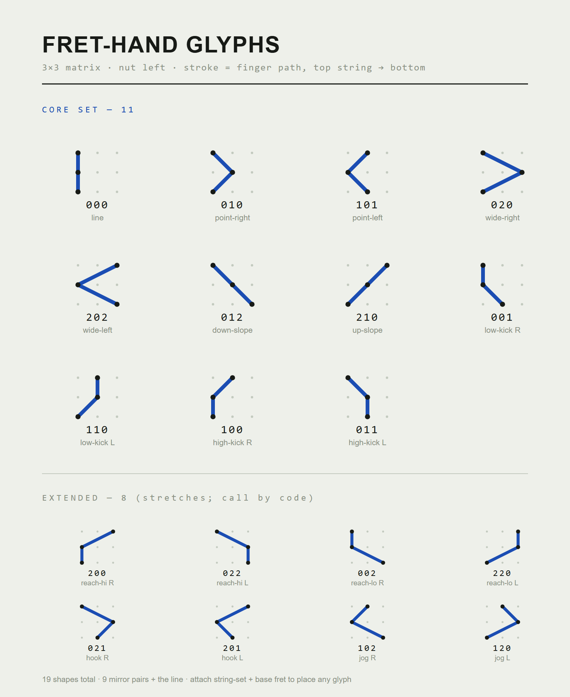

# Fret-Hand Glyphs

A shorthand for writing guitar voicings as **shapes** rather than chord names, and a
tool that picks voicings for a set of changes by minimising hand movement.

Write your changes in a plain text file, run one command, get an SVG chart where every
chord carries a small glyph showing exactly how to finger it.

No dependencies for the core: Python 3.8+, standard library only. (The optional PDF
importer is the sole exception — it needs PyMuPDF.)

---

## Quick start

```bash
python3 sheet.py mack.pro
```

Writes `mack-tick.svg` next to the source. Open it in any browser.

```bash
python3 sheet.py mack.pro --both          # tick and stretch versions
python3 sheet.py mack.pro -m stretch -o chart.svg
python3 sheet.py mack.pro --home 5 --skip-pen -1.2   # open voicings, 5th position
```

---

## The notation

Every voicing is three notes, one per string, spanning at most three frets. That box
has exactly **19 possible shapes** after you slide it so the leftmost note sits at
column 0 — and 19 is the entire alphabet, permanently.

A written voicing is four things:

| part | what it says | example |
|---|---|---|
| **glyph** | the finger contour, drawn top string → bottom | `╲` |
| **numeral** | which string the top note is on | `2` |
| **tick / height** | which strings are skipped, if any | one red tick |
| **fret number** | where the shape starts | `8` (red) |

The glyph is drawn as a single pen stroke through the three notes, highest string
first. That is also its name: read the fret offsets top to bottom and you get a
three-digit **code** (`012`, `110`, `202`…). The code and the picture are the same
object, which is why nothing here needs a lookup table.

Because the code only describes fret offsets, it does not care *which* three strings
you use. All 20 string sets share the same 19 shapes.

### The alphabet — all 19 shapes



Read each shape the way the fret hand sees it: the three rows are the three strings
(highest pitch on top), the three columns are three frets with the **nut on the left**,
and the stroke traces the finger path top string to bottom. The three-digit code is just
the fret column of each note read top to bottom. The vertical line is the only shape that
mirrors to itself; the other 18 pair off under left-right mirroring — so the whole
alphabet is really **10 shapes plus a flip rule**.

The same 19 as plain text (`#` = a fretted note), in case the image above doesn't load:

```
vertical line
  000
  #..
  #..
  #..

9 mirror pairs (each shape beside its left-right flip):

  001 110         002 220         010 101
  #.. .#.         #.. ..#         #.. .#.
  #.. .#.         #.. ..#         .#. #..
  .#. #..         ..# #..         #.. .#.

  011 100         012 210         020 202
  #.. .#.         #.. ..#         #.. ..#
  .#. #..         .#. .#.         ..# #..
  .#. #..         ..# #..         #.. ..#

  021 201         022 200         102 120
  #.. ..#         #.. ..#         .#. .#.
  ..# #..         ..# #..         #.. ..#
  .#. .#.         ..# #..         ..# #..
```

The drawn plate — single-stroke glyphs, string-set styles, and the handwriting forms —
lives in [`reference/01-alphabet.svg`](reference/01-alphabet.svg).

### Two ways to draw a skipped string

- **tick** — glyph height is fixed; a red tick crosses the stroke wherever a string is
  skipped. Compact, uniform line height, fast to write by hand.
- **stretch** — the stroke spans the real strings, so the picture shows the reach
  directly and needs no extra marks. Unambiguous, but row height becomes variable.
- **anchored** — tick geometry, but each note is drawn as a node: an open ring on the
  top string, a half-filled dot on the middle, a solid dot on the bottom (ink deepens as
  pitch descends, so the glyph reads top-to-bottom on its own). Any two-fret stretch
  turns the middle node into a diamond, so reach-1 and reach-2 shapes never blur.

Use `-m tick`, `-m stretch`, or `-m anchored`. Same underlying data; only the drawing
differs. For close voicings stretch is often *shorter* than tick, since an adjacent set
is only two string-gaps tall.

See `reference/` for the full alphabet, the handwriting forms, and both string-set
styles.

---

## The changes file

```
{title: Mack the Knife}
{subtitle: arr. Tony Guerrero}
{key: Bb}
{tempo: 160}

{section: B - head}
|: Bb6 | % | Cm7 | % |
| F7 | % | Bb6 | % |
| Dm7 | Dbo7 | Cm7 | F7 |
| Cm7 | F7 | Bb6 | % :|
```

| syntax | meaning |
|---|---|
| `\| chord \|` | one bar |
| `\| Cm7 F7 \|` | two chords in a bar, split evenly |
| `Bb6!` / `Bb6~` | force the root **in** (as played) / **out** for that chord |
| `%` | repeat the previous bar |
| `\|:` … `:\|` | repeat marks |
| `{section: name}` | starts a labelled section |
| `#` | comment |

Repeats are **not** expanded before voicing. Each written bar is voiced once, so a
repeated section is fingered identically both times through.

Chord symbols understood: plain triads — `Bb` (major), `Bbm` (minor), `Bbo`/`Bbdim`,
`Bb+`/`Bbaug` — and sixths/sevenths — `6`, `m7`, `m9`, `7`, `13`, `o7` (or `dim7`),
`m7b5`, `maj7` — all with `b`/`#` roots. A bare root is a **major triad** (`Bb`), not a
sixth; write `Bb6` for the six chord.

---

## Importing from a PDF (optional)

If your chart is an **engraved, digital** PDF — exported from Finale, Sibelius,
MuseScore and the like, with a real text layer — `pdfimport.py` pulls the chord
symbols straight into a changes file:

```bash
pip install pymupdf                          # the one extra dependency
python3 pdfimport.py "chart.pdf" -o chart.pro
python3 pdfimport.py "chart.pdf"             # or just print to stdout
```

It works because chord symbols sit in their own font: it reads *only* those spans and
rebuilds bars and sections from the staff-line and barline geometry, so it never has to
recognise a single note. Every symbol is checked against the chord grammar — anything it
can't parse is written as a `#?`-flagged comment instead of being trusted, and the file
carries a `VERIFY before trusting` header.

What it deliberately does **not** do:

- **Scanned or photographed charts.** No text layer means OCR/OMR, which is out of
  scope — it refuses them with a clear message rather than guessing.
- **Repeats, endings, and vamps.** These aren't in the chord layer, so empty measures
  become `%` and you re-add the structure by hand.

Treat the output as a fast, verifiable first draft — not a transcription.

---

## How voicings get chosen

`voice.py` enumerates every legal three-note shape for each chord across all 20 string
sets, keeps only those containing both guide tones (3rd and 7th), then runs a Viterbi
pass over the whole tune to find the path with the least hand movement.

Four knobs:

| flag | default | effect |
|---|---|---|
| `--home` | 8.5 | preferred neck position, in frets |
| `--span` | 5.0 | how far a voicing may stray from home |
| `--switch-pen` | 3.0 | cost of changing string set — raise it for fewer crossings |
| `--skip-pen` | 0.25 | cost of skipping strings. `0` mixes; **negative prefers open voicings** |

`--skip-pen -1.2` is the interesting one: it turns close comping into spread
chord-melody voicings without moving the hand.

Rootless voicings are preferred automatically. To override this per chord, append `!`
to force the root **in** (voiced the way it's played) or `~` to force it **out**; the
choice lives in the chart, next to the music. A plain triad has no root to drop, so the
same markers pick the **inversion** instead: first inversion (third in the bass) by
default, root position under `!`. A chord symbol printed in red on the sheet means that
voicing does contain its root.

---

## Files

| file | role |
|---|---|
| `sheet.py` | CLI and sheet layout |
| `voice.py` | fretboard model, shape enumeration, voice-leading search |
| `chartparse.py` | changes-file parser; preserves bars, sections, repeats |
| `render.py` | glyph drawing; the tick/stretch/anchored register toggle lives here |
| `pdfimport.py` | optional engraved-PDF → changes-file importer (needs PyMuPDF) |
| `mack.pro` | worked example |
| `reference/` | the alphabet and notation plates |

Import it directly if you'd rather script it:

```python
from voice import lead_free
for sym, code, fret, roles, frets, strings in lead_free(['Dm7','G7','C6'], home=7):
    print(sym, code, fret, strings)
```

---

## Known limits

- **Three notes per voicing.** Four-note shapes would need a 4×3 box and a larger
  alphabet.
- **Standard tuning only** — change `OPEN` in `voice.py` for anything else.
- **Import is limited.** `pdfimport.py` reads *engraved, digital* PDFs (see above), but
  scanned charts (OCR/OMR) and MusicXML are not supported, and repeat/vamp structure is
  never recovered from a PDF.
- **The example file is a reconstruction.** The bar rhythm in `mack.pro` was inferred
  from a printed chart, including the assumption that the opening `Bb6` is a four-bar
  vamp before the sixteen-bar form. Correct it and re-run; voicings recompute.
